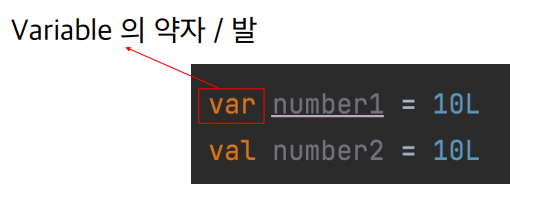

# Lec 01. 코틀린에서 변수를 다루는 방법

## 목차
1. [변수 선언 키워드 - var과 val의 차이점](#1-변수-선언-키워드---var과-val의-차이점)
2. [Kotlin에서의 Primitive Type](#2-kotlin에서의-primitive-type)
3. [Kotlin에서의 nullable 변수](#3-kotlin에서의-nullable-변수)
4. [Kotlin에서의 객체 인스턴스화](#4-kotlin에서의-객체-인스턴스화)
5. [정리](#정리)

## 1. 변수 선언 키워드 - var과 val의 차이점

- Java에서 long과 final long의 차이

- 이 변수가 가변인가, 불변 인가의 차이
- 변경이 가능한 Variable을 줄여 var(발)이라고 부른다.

- 변경 불가능한 Value를 줄여 val(밸)이라고 부른다,

- 코틀린에서는 모든 변수에 수정가능 여부(var / val)를 명시해주어야 한다.

- 타입을 명시적으로 작성해줄 수도 있다.

- var 값은 초기값을 지정해주 읺으면 컴파일 에러가 발생한다.

- val 컬렉션에는 element를 추가할 수 있다.
- 모든 변수는 우선 val로 만들고 꼭 필요한 경우 var로 변경한다.

## 2. Kotlin에서의 Primitive Type
- 코틀린에서는 Reference Type 대신 Primitive Type을 사용해야 한다.
  - 실행시에는 Primitive Value로 표현되지만, 코드에서는 평범한 클래스처럼 보인다.
  - 코틀린에서는 프로그래머가 boxing/ unboxing을 고려하지 않아도 되도록 내부적으로 코틀린이 알아서 처리해준다.
  
## 3. Kotlin에서의 nullable 변수
- Kotlin에서 null 변수에 들어갈 수 있다면 "타입?"를 사용해야 한다.

## 4. Kotlin에서의 객체 인스턴스화
- Kotlin에서 객체 인스턴스화를 할 때에는 new를 붙이지 않아야 한다.

## 정리
- 모든 변수는 var / val을 붙여 주어야 한다.
  - var : 변경 가능하다 / val : 변경 불가능하다(read-only)
- 타입을 명시적으로 작성하지 않아도, 타입이 추론된다.
- Primitive Type과 Reference Type을 구분하지 않아도 된다.
- Null이 들어갈 수 있는 변수는 타입 뒤에 ? 를 붙여 주어야한다.
  - 아예 다른 타입으로 간주된다.
- 객체를 인스턴스화 할 때 new를 붙이지 않는다.