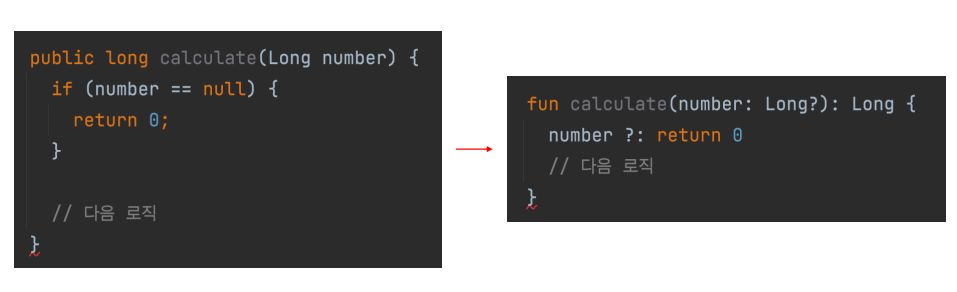
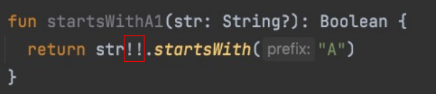
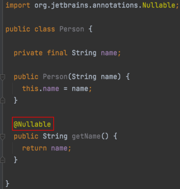

# Lec 02. 코틀린에서 null을 다루는 방법

## 목차
[1. Kotlin에서의 null 체크](#1-kotlin에서의-null-체크)  
[2. Safe Call과 Elvis 연산자](#2-safe-call과-elvis-연산자)  
[3. 널 아님 단언!!](#3-널-아님-단언--)  
[4. 플랫폼 타입](#4-플랫폼-타입)  
[5. 정리](#정리)

## 1. Kotlin에서의 null 체크
  
위 Null-Safe 하지 않은 코드를 Null-Safe하게 만들어보자 
1. str이 null일 경우 Exception을 내는 방법  
  
2. str이 null인 경우 null을 반환하는 방법  
  
3. str이 null인 경우 false를 반환하는 방법  

 Kotlin에서는 null이 가능한 타입을 **완전히 다르게 취급**한다.

## 2. Safe Call과 Elvis 연산자
nullable 필드에 대해 다루는 방법 두가지을 알아보자

### 2-1. Safe Call(?.)  
  
null이 아니면 실행하고, null이면 실행하지 않는다.(그대로 null)  
### 2-2. Elvis 연산자(?:)  
    
앞의 연산 결과가 null이면 뒤의 값을 사용  

### 위에서 작성한 null-safe하게 만들었던 함수에 Safe Call과 Elvis 연산을 적용해보자  
1. str이 null일 경우 Exception을 내는 방법  
  

2. str이 null인 경우 null을 반환하는 방법  
  

3. str이 null인 경우 false를 반환하는 방법  
  

### Elvis 연산은 early return에도 사용할 수 있다
  

## 3. 널 아님 단언!!
  
- nullable type이지만, 아무리 생각해도 null이 될 수 없는 경우 !!로 null이 아님을 단언할 수 있음  
- 혹시나 null이 들어오면 NPE가 발생하므로 확실한 경우에만 널아님 단언!!을 사용해야 한다.

## 4. 플랫폼 타입
### Kotlin에서 Java 코드를 가져다 사용할 때 어떻게 처리될까?  
  
- @Nullable이 없다면 코틀린에서는 이 값이 nullable인지 non-nullable인지 알 수가 없다.
- 플랫폼 타입 : 코틀린이 null 관련 정보를 알 수 없는 타입 Runtime 시 Exception이 날 수 있다.

## 정리
- 코틀린에서 null이 들어갈 수 있는 타입은 완전히 다르게 간주된다.
  - 한번 null 검사를 하면 non-null임을 컴파일러가 알 수 있다.
- null이 아닌 경우에만 호출되는 Safe Call(?.)이 있다.
- null인 경우에만 호출되는 Elvis 연산자(?:) 가 있다.
- null이 절대 아닐 때 사용할 수 있는 널 아님 단언(!!)가 있다.
- Kotlin에서 Java 코드를 사용할 때 플랫폼 타입 사용에 유의해야 한다.
  - Java 코드를 읽으며 널 가능성 확인 / Kotlin으로 wrapping