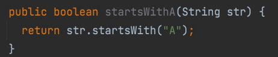
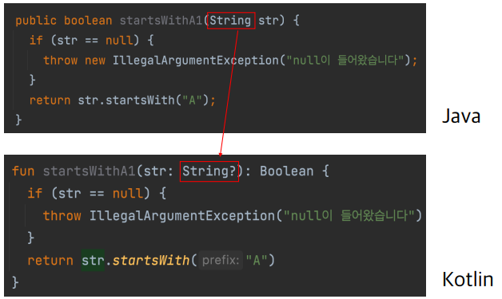
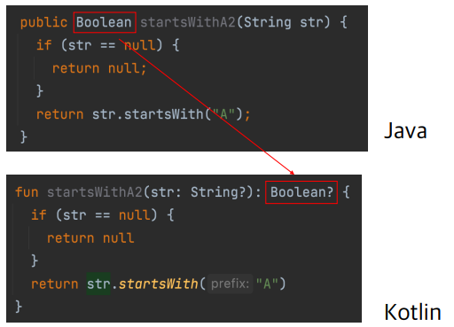
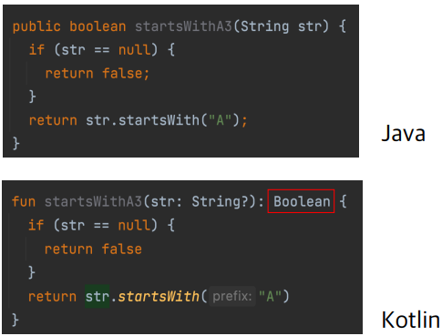
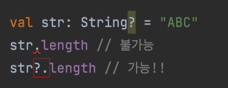
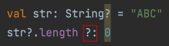
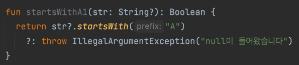
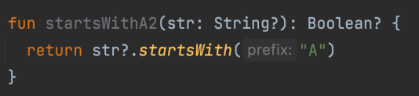
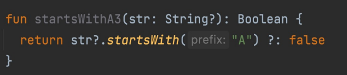

# Lec 02. 코틀린에서 null을 다루는 방법

## 목차
[1. Kotlin에서의 null 체크](#1-kotlin에서의-null-체크)  
[2. Safe Call과 Elvis 연산자](#2-safe-call과-elvis-연산자)  
[3. 널 아님 단언!!](#3-널-아님-단언--)  
[4. 플랫폼 타입](#4-플랫폼-타입)  
[5. 정리](#정리)

## 1. Kotlin에서의 null 체크
  
위 Null-Safe 하지 않은 코드를 Null-Safe하게 만들어보자 
1. str이 null일 경우 Exception을 내는 방법  
  
2. str이 null인 경우 null을 반환하는 방법  
  
3. str이 null인 경우 false를 반환하는 방법  

 Kotlin에서는 null이 가능한 타입을 **완전히 다르게 취급**한다.

## 2. Safe Call과 Elvis 연산자
nullable 필드에 대해 다루는 방법 두가지을 알아보자

### 2-1. Safe Call(?.)  

null이 아니면 실행하고, null이면 실행하지 않는다.(그대로 null)  
### 2-2. Elvis 연산자(?:)  
  
앞의 연산 결과가 null이면 뒤의 값을 사용  

### 위에서 작성한 null-safe하게 만들었던 함수에 Safe Call과 Elvis 연산을 적용해보자  
1. str이 null일 경우 Exception을 내는 방법  

2. str이 null인 경우 null을 반환하는 방법  

3. str이 null인 경우 false를 반환하는 방법  

## 3. 널 아님 단언!!

## 4. 플랫폼 타입

## 정리