# Lec 03. 코틀린에서 Type을 다루는 방법

## 목차
[1. 기본타입](#1-기본타입)  
[2. 타입 캐스팅](#2-타입-캐스팅)  
[3. Kotlin의 3가지 특이한 타입](#3-kotlin의-3가지-특이한-타입)  
[4. String Interpolation, String indexing](#4-string-interpolation-string-indexing)  
[정리](#정리)  

## 1. 기본타입
### 코틀린에서는 선언된 기본 값을 보고 타입을 추론한다.  

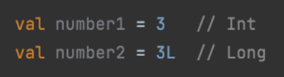

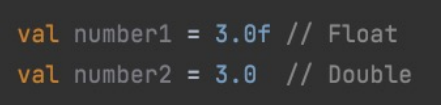  

### Java와 다른 내용
- Java는 기본 타입 간의 변환은 암시적으로 이루어질 수 있다.  
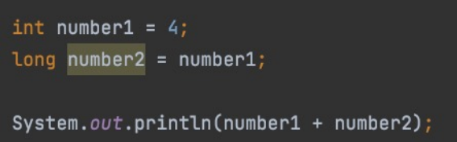  
- Kotlin은 기본 타입간의 변환은 명시적으로 이루어져야 한다.  
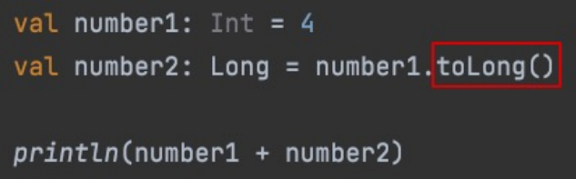
  - to변환타입()을 사용해야 한다.

## 2. 타입 캐스팅
## Java에서 일반 타입의 타입 캐스팅  
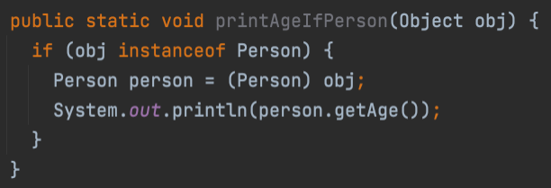
- instanceof : 변수가 주어진 타입이면 true, 그렇지 않으면 false
- (타입) : 주어진 변수를 해당 타입으로 변경한다.

## Kotlin에서 타입 캐스팅

### is와 as 타입 
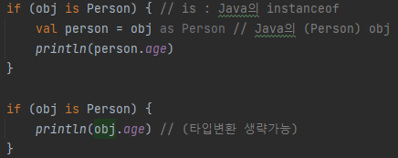
- is : Java의 instanceof
- as Person : Java의 (Person) obj
- 스마트 캐스트로 as Person은 생략 가능  

### is!
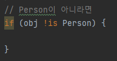  
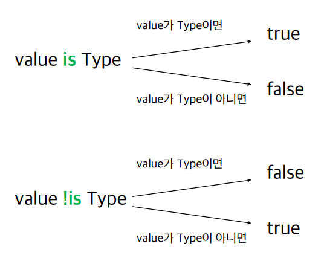  
- instanceof의 반대 개념

### as
- as 로 바로 타입 캐스팅이 가능  
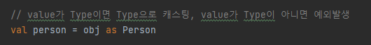  
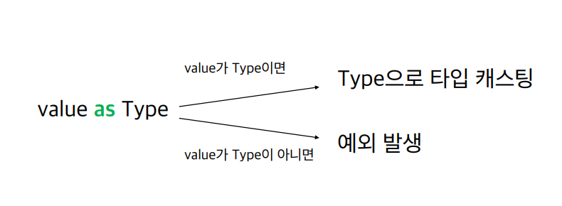   

- as?를 사용하면 null이거나 타입이 아니면 null을 반환  
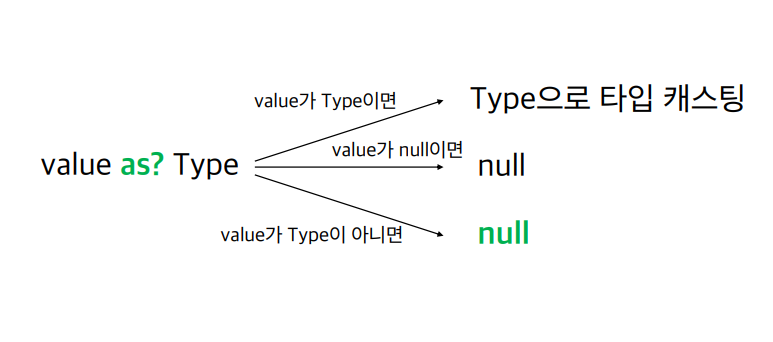

## 3. Kotlin의 3가지 특이한 타입

### Any
- Java의 Object 역할. (모든 객체의 최상위 타입)
- 모든 Primitive Type의 최상의 타입도 Any이다.
- Any 자체로는 null을 포함할 수 없어 null을 포함하고 싶다면 Any?로 표현
- Any에 equals / hashCode / toString 존재

### Unit
- Unit은 Java의 void와 동일한 역할
- void와 다르게 Unit은 그 자체로 타입 인자로 사용 가능하다.
- 함수형 프로그래밍에서 Unit은 단 하나의 인스턴스만 갖는 타입을 의미. 즉, 코틀린의 Unit은 실제 존재하는 타입이라는 것을 표현

### Nothing
- Nothing은 함수가 정상적으로 끝나지 않았다는 사실을 표현하는 역할
- 무조건 예외를 반환하는 함수 / 무한 루프 함수 등  
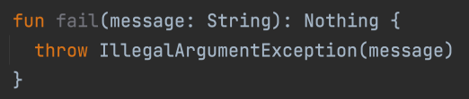

## 4. String Interpolation, String indexing
### 자바에서의 문자열 보간법
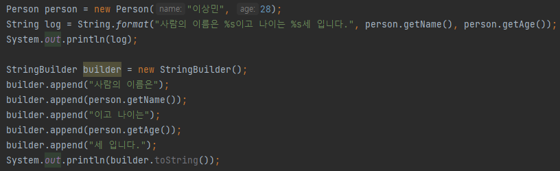  
- String.format 메서드나 StringBuilder를 사용한다.
### 코틀린에서의 문자열 보간법
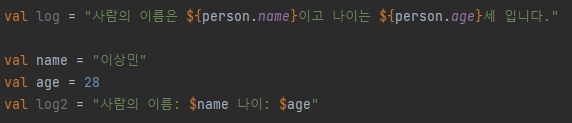  
- ${변수}를 사용하면 값이 들어간다.
- $변수를 사용할 수도 있다.
- 변수 이름만 사용하더라도 ${변수}를 사용하는 것이 가독성, 일괄 변환, 정규식 활용 측면에서 좋음

### 코틀린에서 들여쓰기 제거
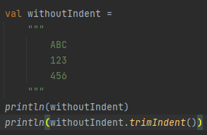  
출력 결과  
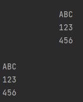  
- 들여쓰기 제거는 trimIndent() 메서드로 제거 할 수 있다.

### 자바에서의 문자열의 특정 문자 가져오기
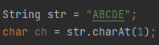  

### 코틀린에서의 문자열의 특정 문자 가져오기
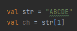  
- 배열의 인덱스 접근처럼 가져올 수 있음

## 정리
- 코틀인의 변수는 초기값을 보고 타입을 추론하며, 기본 타입들 간의 변환은 명시적으로 이루어진다.
- 코틀린에서는 is, !is, as, as? 를 이용해 타입을 확인하고 캐스팅한다.
- 코틀린의 Any는 Java의 Object와 같은 최상위 타입이다.
- 코틀린에서 Unit은 Java의 void와 동일하다.
- 코틀린에 있는 Nothing은 정상적으로 끝나지 않는 함수의 반환을 의미한다.
- 문자열을 가공할 때 ${변수}와 """ """를 사용하면 깔끔한 코딩이 가능하다.
- 문자열에서 문자를 가져올 때 Java의 배열처럼 []를 사용한다.

