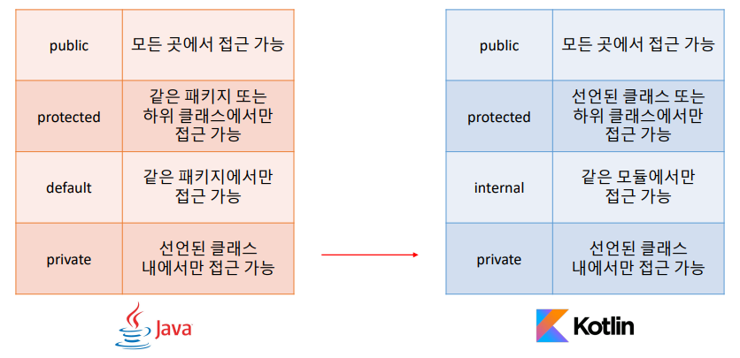
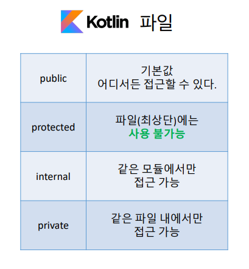
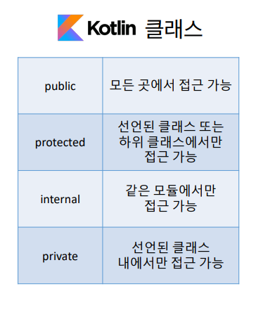
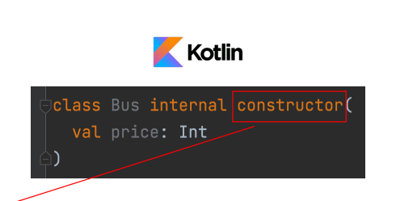

# Lec 11. 코틀린에서 접근 제어를 다루는 방법

## 목차
1. 자바와 코틀린의 가시성 제어
2. 코틀린 파일의 접근 제어
3. 다양한 구성요소의 접근 제어
4. Java와 Kotlin을 함께 사용할 경우 주의할 점

## 1. 자바와 코틀린의 가시성 제어

- 코틀린에서는 protected는 선언된 클래스 또는 하위 클래스에서만 접근 가능하다.
- 코틀린에서는 패키지를 namespace를 관리하기 위한 용도로만 사용하고 가시성 제어에는 사용되지 않는다.
- default도 코틀린에서는 없고 internal이라는 새로운 가시성 제어가 생김.
- 여기서 모듈은 한번에 컴파일되는 코틀린 코드를 의미한다.
- Java의 기본 접근 지시어가 default지만 Kotlin의 기본 접근 지시어는 public이다.

## 2. 코틀린 파일의 접근 제어

- 코틀린은 .kt 파일에 변수, 함수, 클래스 여러개를 만들 수 있다.

## 3. 다양한 구성 요소의 접근제어
### 클래스 안에 멤버

### 생성자
 

생성자도 가시성 범위는 동일하나 생성자에 접근 지시어를 붙이려면, constructor를 써야한다.

### 프로퍼티

.png)
.png)

## 4. Java와 Kotlin을 함께 사용할 때 주의할 점
- Kotlin의 protected와 Java의 protected는 다르다. Java는 같은 패키지의 Kotlin protected 멤버에 접근할 수 있다

## 정리
- Kotlin에서 패키지는 namespace 관리용이기 때문에 protected는 의미가 달라졌다.
- Kotlin에서 default가 사라지고, 모듈간의 접근을 통제하는 internal이 새로 생겼다.
- 생성자에 접근 지시어를 붙일 때는 constructor를 명시적으로 써주어야 한다.
- 유틸성 함수를 만들 때는 파일 최상단을 이용하면 편하다.
- 프로퍼티의 custom setter에서 접근 지시어를 붙일 수 있다.
- Java에서 Kotlin 코드를 사용할 때 internal과 protected는 주의해야 한다.
