# Lec 12. 코틀린에서 object 키워드를 다루는 방법

## 목차
1. [static 함수와 변수](#1-static-함수와-변수)
2. [싱글톤](#2-싱글톤)
3. [익명클래스](#3-익명-클래스)
4. [정리](#정리)

## 1. static 함수와 변수
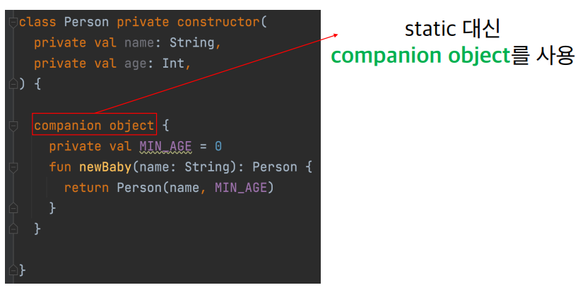
- 코틀린에서는 static이라는 개념이 없고 대신 companion object를 사용
  - static : 클래스가 인스턴스화 될 때 새로운 값이 복제되는 게 아니라 정적으로 인스턴스끼리의 값 공유
  - companion object : 클래스와 동행하는 유일한 오브젝트

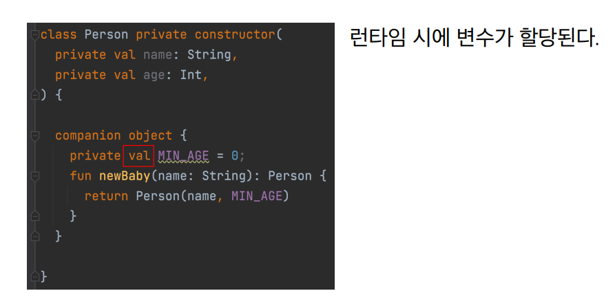
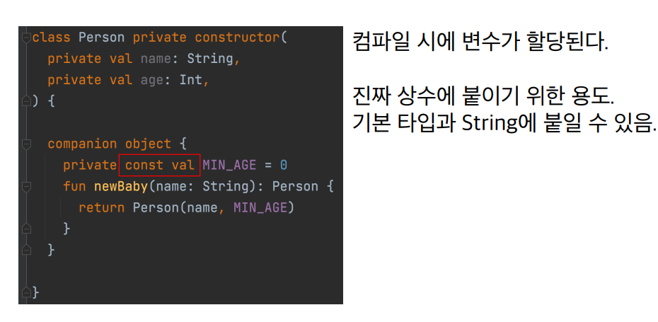

- 상수 처럼 사용하기 위해서는 const가 붙어야 한다.(기본 타입과 String에 붙일 수 있다.)

### 자바와 다른 점
- companion object, 즉 동반객체도 하나의 객체로 간주되므로 이름을 붙일 수 있고, interface를 구현할 수 있다.

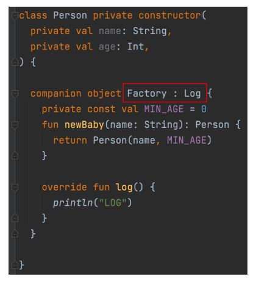
- Factory라는 이름을 붙일 수 있다
- Log 인터페이스를 구현할 수 있다.

### 사용법
1. 이름이 없는 경우  
 
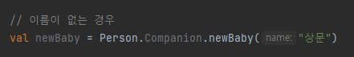

2. @JvmStatic

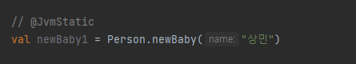

3. 이름이 있는 경우

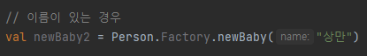

## 2. 싱글톤
### 자바에서의 싱글톤
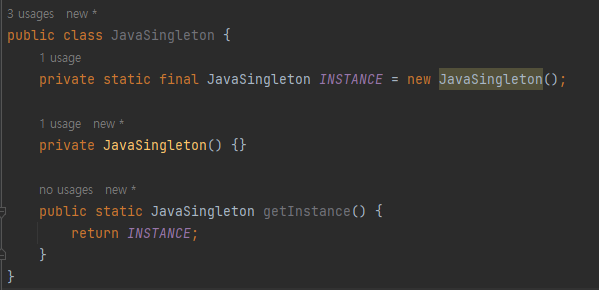

### 코틀린에서의 싱글톤
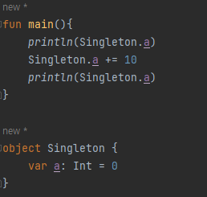
- object만 붙여주면 된다.

## 3. 익명 클래스
- 익명 클래스란 특정 인터페이스나 클래스를 상속받은 구현체를 일회성으로 사용할 때나 쓰는 클래스

### 자바에서의 익명클래스  
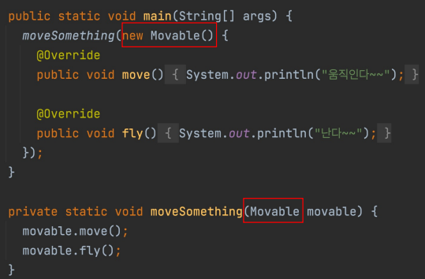

- 자바에서는 new 타입 이름()
### 코틀린에서의 익명클래스
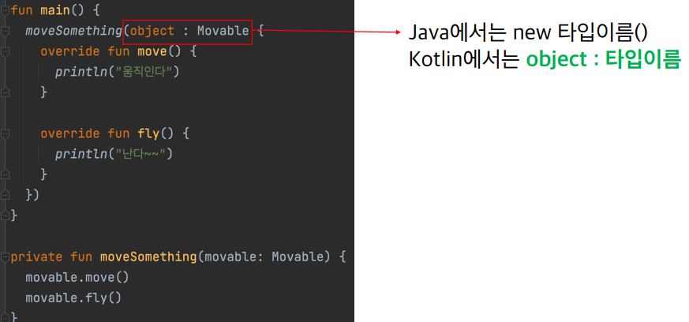
- 코틀린에서는 object : 타입 이름

## 정리
- Java의 static 변수와 함수를 만드려면, Kotlin에서는 companion object를 사용해야 한다.
- companion object도 하나의 객체로 간주되기 때문에 이름을 붙일 수 있고, 다른 타입을 상속, 인터페이스를 구현할 수 있다.
- Kotlin에서 싱글톤 클래스를 만들 때 object를 사용한다.
- Kotlin에서 익명 클래스를 만들 때 object : 타입 을 사용한다.
